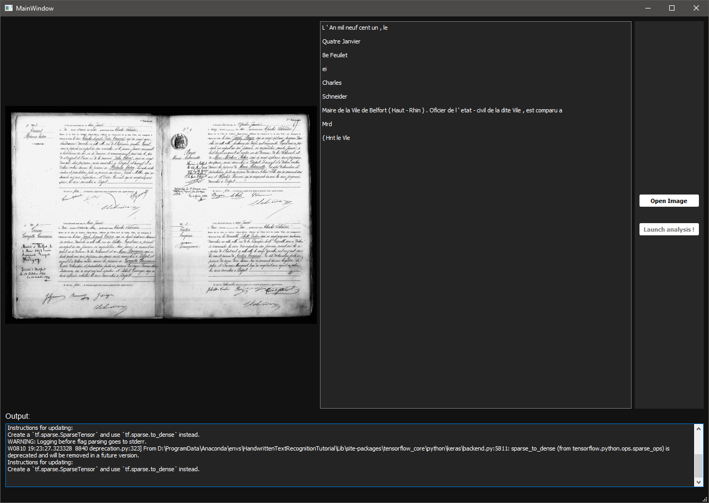

# VitalRecordAnalyzer

*abstract*

`
Vital records are rich of meaningful historical data concerning city as well as countryside inhabitants that can be used, among others, to study former populations and then reveal the social, economic and demographic characteristics of those populations. However, these studies encounter a main difficulty for collecting the data needed since most of these records are scanned documents that need a manual transcription step in order to gather all the data and start exploiting it from a historical point of view. This step consequently slows down the historical research and is an obstacle to a better knowledge of the population habits depending on their social conditions. Therefore in this paper we present a modular and self-sufficient analysis pipeline using state-of-the-art algorithms mostly regardless of the document layout that aims to automate this data extraction process.
`

```
@unpublished{plateauholleville:hal-03189188,
  TITLE = {{French vital records data gathering and analysis through image processing and machine learning algorithms}},
  AUTHOR = {Plateau-Holleville, Cyprien and Bonnot, Enzo and Gechter, Franck and Heyberger, Laurent},
  URL = {https://hal.archives-ouvertes.fr/hal-03189188},
  NOTE = {working paper or preprint},
  YEAR = {2021},
  KEYWORDS = {Historical Data ; Optical Character Recognition ; Handwritten Text Recognition ; Machine Learning},
  PDF = {https://hal.archives-ouvertes.fr/hal-03189188/file/French_vital_records_data_gathering_and_analysis_through_image_processing_and_machine_learning_algorithms.pdf},
  HAL_ID = {hal-03189188},
  HAL_VERSION = {v1},
}
```

*This project is a proof of concept that should not be used for production purposes as it is, since it can be highly unstable.*

## Features

### DatasetBuilder

- Auto segmentation of a text sample image
- GUI to help and speed up the translation of image text into ascii by the user
  -  Shortcut (Enter to validate translation, Escape to skip the current image)
- Provide JSON file containing translated text and segmented fragment into the selected folder


### CivilRegistryAnalyser

- Auto segmentation of a text sample image
- Text recognition on fragmented images
- Text features extractions with NLP.


   
## Installation

### Dependencies

- OpenCv (Tested with >= 4.0.1)
- Qt (Tested with >= 5.11.2)
- Python 3 

You might also need CUDA if you want to use Tensorflow's GPU version.

In order to use conda environment inside the software you need to provide the following environment variables :

- PYTHONHOME = `<PathToAnacondaInstallation>\Anaconda\envs\<TheEnvironmentYouWantToUse>`
- PYTHONPATH = 
    - `<PathToAnacondaInstallation>\Anaconda\envs\<TheEnvironmentYouWantToUse>\DLLs\`
    - `<PathToAnacondaInstallation>\Anaconda\envs\<TheEnvironmentYouWantToUse>\Lib\`
    - `<PathToAnacondaInstallation>\Anaconda\envs\<TheEnvironmentYouWantToUse>\Lib\site-packages`
- Add the following paths in your PATH :
    - `<PathToAnacondaInstallation>\Anaconda\envs\<TheEnvironmentYouWantToUse>\Library\bin`
    - `<PathToAnacondaInstallation>\Anaconda\envs\<TheEnvironmentYouWantToUse>\Scripts`
    - `<PathToAnacondaInstallation>\Anaconda\envs\<TheEnvironmentYouWantToUse>\Library`

### Clone and  Build

```
git clone --recurse-submodules -j8 https://github.com/PlathC/CivilRegistryAnalyser.git
cd CivilRegistryAnalyser
pip install -r requirements.txt

mkdir build && cd build
cmake ..
cmake --build .
```

## Assets

For any other dataset than the one created using the DatasetBuilder you can follow this [tutorial](https://github.com/arthurflor23/handwritten-text-recognition/blob/master/src/tutorial.ipynb) 

### Dataset transformation

Once the image transcription is finished and that you have enough data create a `raw` folder in the `py` folder and a `civil` folder in the `raw` folder. Once all the folders are 
created, put all the folders created by the DatasetBuilder and the `transcription.json` file in the `civil` folder. Then you can run the `transform.py` that will create the HDF5 file 
that will be read for the training. You will find this file in the `data` folder that has been created.

### Model training

To train the model on the dataset you've just created you just need to run the `training.py` file.

If when training your model on the dataset created thanks to our dataset builder you have an error such as `No valid path found` for the loss calculator, try to go to the definition of the 
function `ctc_batch_cost()` used line 261 in the `ctc_loss_lambda_func()` function in the `src/network/model.py`. Once you're in the function `ctc_batch_cost()` add the parameter `ignore_longer_outputs_than_inputs=True`
to the `ctc.ctc_loss()` function that should be on lines 5763-5764.

### Model testing

Once the training is finished you can run tests to see if the training you have done is efficient. To do so you just need to run the `test.py` file. If you want to replace the
model used in the CivilRegistryAnalyser you need to replace the `checkpoint_weights.hdf5` file in the `py` folder by the one that has been created in `output/civil/flor`. 

### EAST model

For text segmentation we used the EAST (An Efficient and Accurate Scene Text Detector) model with a dataset that we created. All the files used for the EAST model and training can be found in the `py/EAST` folder. To train the model the file used is `multigpu_train.py` and the dataset path should be provided in the `icdar.py` for the `training_data_path` flag. Once the model has been trained the graph can be frozen with the `convert_graph.py` and then used with opencv to run the text detection with the `eval_frozen_graph.py`file.

## Based on

- [arthurflor23 / handwritten-text-recognition](https://github.com/arthurflor23/handwritten-text-recognition)
- [arthurflor23 / text-segmentation](https://github.com/arthurflor23/text-segmentation)
- [argman / EAST](https://github.com/argman/EAST)

## Contributors

[Enzo Bonnot](https://github.com/enzo-bonnot)

[Cyprien Plateau--Holleville](https://github.com/PlathC)
