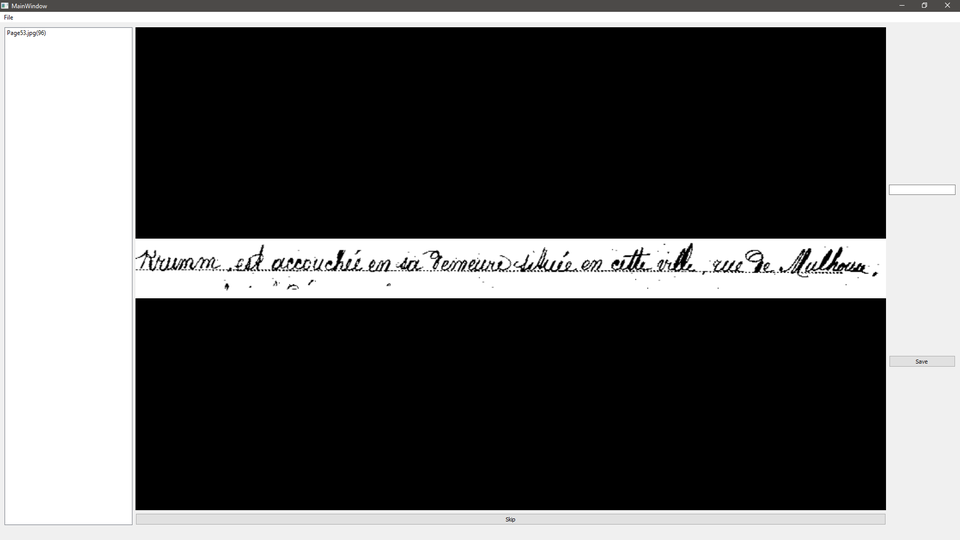

# CivilRegistryAnalyzer

This tools aims to assist the segmentation of civil registry documents with image processing and machine learning
algorithms.

## Features

### DatasetBuilder

- Auto segmentation of a text sample image
- GUI to help and speed up the translation of image text into ascii by the user
  -  Shortcut (Enter to validate translation, Escape to skip the current image)
- Provide JSON file containing translated text and segmented fragment into the selected folder



### CivilRegistryAnalyser

- Auto segmentation of a text sample image
- Detection of text inside fragment images   
   
## Installation

### Dependencies

- OpenCv (Tested with >= 4.0.1)
- Qt (Tested with >= 5.11.2)
- Python 3 (You need to provide PYTHONHOME environment variable)

You might also need CUDA if you want to use Tensorflow's GPU version.

### Clone and  Build

```
git clone --recurse-submodules -j8 https://github.com/PlathC/CivilRegistryAnalyser.git
cd CivilRegistryAnalyser
pip install -r requirements.txt

mkdir build && cd build
cmake ..
cmake --build .
```

### Based on

- [arthurflor23 / handwritten-text-recognition](https://github.com/arthurflor23/handwritten-text-recognition)
- [arthurflor23 / text-segmentation](https://github.com/arthurflor23/text-segmentation)

### Contributors

[Enzo Bonnot](https://github.com/enzo-bonnot)

[Cyprien Plateau--Holleville](https://github.com/PlathC)
